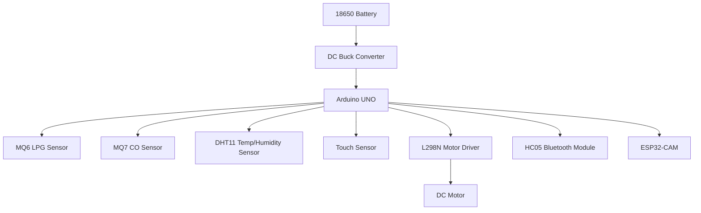
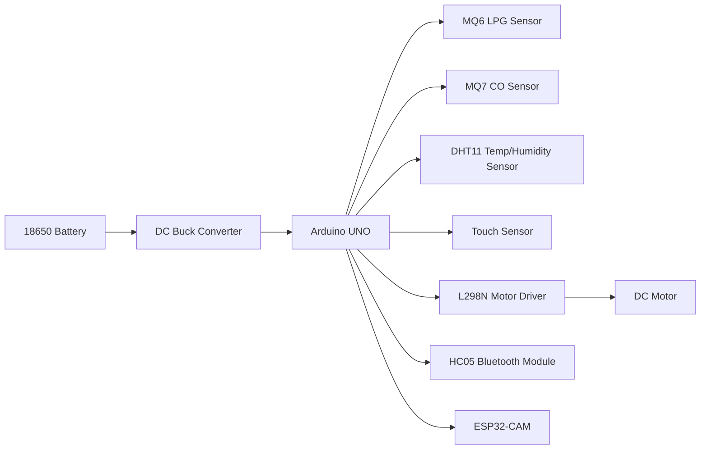

# Tunnel Inspection Robot

## Block Diagram

## Components
1. Arduino UNO

### Arduino UNO
Atmega328p is a popular open-source microcontroller board for prototyping and education, based on the ATmega328P

##### Specifications

- **Microcontroller:** ATmega328P
- **Operating Voltage:** 5 V
- **Input Voltage (recommended):** 7–12 V
- **Digital I/O Pins:** 14 (6 PWM outputs)
- **Analog Input Pins:** 6
- **Flash Memory:** 32 KB (ATmega328P) of which 0.5 KB used by bootloader
- **SRAM:** 2 KB
- **EEPROM:** 1 KB
- **Clock Speed:** 16 MHz
- **LED_BUILTIN:** Pin 13

### MQ6

MQ6 is a liquefied petroleum gas (LPG) sensor, suitable for sensing LPG (composed of mostly propane and butane) concentrations in the air
- MQ-6 gas sensor can detect kinds of flammable gases, especially has high sensitivity to LPG (propane). It is a kind of low–cost sensor for many applications.

##### Properties

- **Sensor type:** MQ-6 (semiconductor tin dioxide, SnO2)
- **Detects:** LPG, iso-butane, propane (and other combustible gases)
- **Operating Voltage:** 5 V (heater)
- **Output:** Analog voltage (sensor resistance changes; read with ADC)
- **Recommended Load Resistor (RL):** ~10 kΩ (typical, depends on circuit)
- **Detection Range:** Approx. 100–10,000 ppm (application-dependent; requires calibration)
- **Warm-up / Preheat:** Initial burn-in 24–48 hours recommended; allow a few minutes for routine stabilization
- **Operating Temperature:** ~-10 °C to 50 °C
- **Humidity Range:** 20–90% RH (non-condensing)
- **Interface:** Simple analog divider; optionally combined with comparator or ADC + MCU
- **Notes:** Not highly selective (cross-sensitivity to other gases); requires calibration and periodic baseline checks

### MQ7 

MQ7 is a carbon monoxide (CO) gas sensor, designed to detect CO concentrations in the air. It operates on the principle of a change in resistance of a tin dioxide (SnO2) sensing layer when exposed to CO gas.
 
> Features
* High sensitivity to carbon monoxide
* Stable and long life 

- [Reference](https://robu.in/product/mq-7-co-carbon-monoxide-coal-gas-sensor-module/)

- [Reference](https://cdn.sparkfun.com/assets/b/b/b/3/4/MQ-7.pdf)

### DHT11
**DHT11** is a basic, ultra low-cost digital temperature and humidity sensor

#### Features
- **Sensor Type:** DHT11 (capacitive humidity sensor + thermistor)
- **Measures:** Temperature and Humidity
- **Temperature Range:** 0–50 °C (±2 °C accuracy)
- **Humidity Range:** 20–90% RH (±5% RH accuracy)
- **Operating Voltage:** 3.3–5 V
- **Interface:** Single-wire digital (requires specific timing)
- **Sampling Rate:** 1 Hz (1 reading per second)

### Touch Sensor

"A touch sensor is an electronic device designed to detect and record physical contact or proximity, converting tactile interaction into electrical signals"

#### Features
- Main chip: LM393
- Working voltage: for DC 5V
- Single-channel signal output
- Low-level output signal used for human body touch sensor alarm
- Adjustable sensitivity
- Pin Connector to board: 4 Pins

### L298N 

#### Features
- **Motor Driver Type:** L298N (dual H-bridge motor driver)
- **Channels:** 2 (can control 2 DC motors or 1 stepper motor)
- **Operating Voltage:** 5–35 V (motor supply), 5 V (logic supply)
- **Current Capacity:** Up to 2 A per channel (with proper heat sinking)
- **Max Power Dissipation:** 20W
- **Control Inputs:** 4 (IN1, IN2 for Motor A; IN3, IN4 for Motor B)
- **Enable Pins:** 2 (ENA for Motor A, ENB for Motor B; can be used for speed control via PWM)
- **Direction Control:** IN1/IN2 and IN3/IN4 determine motor direction (forward, reverse, stop)
- **Speed Control:** PWM signal applied to ENA/ENB allows for speed regulation

### HC05 Bluetooth Module
The HC-05 is a popular, low-cost Bluetooth 2.0+EDR module designed for transparent wireless serial communication, enabling Microcontrollers (like Arduino) to connect with phones, laptops, or other modules

HC-05 6 Pin Wireless Serial Bluetooth Module is a Bluetooth module for use with any microcontroller.  It uses the UART protocol to make it easy to send and receive data wirelessly.

1. Working current: matching for 30 mA, matching the communication for 8 mA.
2. Dormancy current: no dormancy.
3. Used for a GPS navigation system, water, and electricity gas meter reading system.
4. With the computer and Bluetooth adapter, PDA, seamless connection equipment.
5. Bluetooth module HC-08 Master and slave Two in one module.
6. Use the CSR mainstream Bluetooth chip, Bluetooth V2.0 protocol standards.
7. Potter default rate of 9600, the user can be set up.
8. Bluetooth protocol: Bluetooth Specification v2.0+EDR
9. Speed: Asynchronous: 2.1Mbps(Max) / 160 kbps, Synchronous: 1Mbps/1Mbps.
10. Security: Authentication and encryption.
11. Profiles: Bluetooth serial port.

### ESP32Cam

The ESP32-CAM is a small, low-cost, and powerful development board combining the ESP32 chipset with Wi-Fi/Bluetooth, a camera interface (often OV2640), and a microSD card slot. It is widely used for IoT, video streaming, surveillance, and DIY, featuring 2MP resolution capabilities and 240MHz processors

#### Features
- **Model Name** -	ESP32-CAM-MB
- **RAM Memory Installed Size**	520 KB
- **Memory Storage Capacity**	4 MB
- **CPU Model**	Cortex A5

### DC Buck Converter
A DC buck converter is a type of power supply that steps down voltage from a higher level to a lower level while maintaining efficient power conversion. It uses a switching regulator to control the flow of energy, making it ideal for applications where power efficiency is crucial, such as in battery-powered devices or when powering components that require lower voltages.

#### Features
- **Input Voltage Range:** ~4V to 15V
- **Output Voltage Range:** Adjustable, 1.5 , 1.8 , 2.5 , 3.3 , 5 V 

### 18650 Battery
18650 is a type of rechargeable lithium-ion battery commonly used in various electronic devices, including laptops, flashlights, and electric vehicles. The name "18650" refers to its dimensions: 18mm in diameter and 65mm in length. These batteries are known for their high energy density, long cycle life, and relatively low self-discharge rate.

#### Features
- **Nominal Voltage:** 3.7 V
- **Capacity:** 2500mAh
- **Chemistry:** Lithium-ion (Li-ion)

### DC Motor
A DC motor is an electric motor that converts direct current electrical energy into mechanical energy. It operates on the principle of electromagnetism, where a current-carrying conductor placed in a magnetic field experiences a force that causes it to rotate. DC motors are widely used in various applications, including robotics, automotive systems, and household appliances, due to their simplicity, reliability, and ease of control.

#### Features
- **Voltage:** 6V
- **Current:** 0.2A
- **Speed:** 200 RPM

## Software
1. Platform IO
2. Android Bluetooth Controller App
### Platform IO

PlatformIO is an open-source ecosystem for IoT development, providing a unified interface for building, testing, and deploying embedded applications across various platforms and frameworks. It supports multiple programming languages, including C/C++, Python, and JavaScript, and integrates with popular IDEs like Visual Studio Code and Atom. PlatformIO offers features such as library management, debugging tools, and continuous integration support, making it a powerful tool for developers working on embedded systems and IoT projects.

### Android Bluetooth Controller App

The Android Bluetooth Controller App is a mobile application designed to facilitate communication between an Android device and Bluetooth-enabled hardware, such as microcontrollers or IoT devices. This app allows users to send commands, receive data, and control connected devices wirelessly via Bluetooth. It typically features a user-friendly interface with buttons, sliders, or other controls to interact with the hardware, making it an essential tool for projects that require remote control or data monitoring through Bluetooth connectivity. The app can be customized to suit specific project needs, allowing developers to create tailored interfaces for their Bluetooth-enabled devices.

